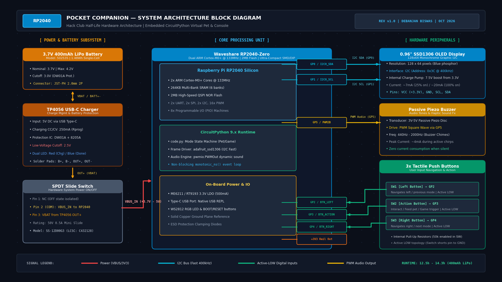

# Pocket Companion — devlog

<!-- Generated by Half Life from project cmuqw217z02uz01rlatu9wyrg. Edits here are overwritten on the next sync. -->
<!-- Generated: 2026-10-03T14:30:00.000Z -->

> [!NOTE]
> This devlog is mirrored from [Half Life](https://halflife.hackclub.com). Editing it here will not change the platform's copy, and the next sync overwrites this file.

> A minimalist, pocket-sized micro pet/reaction device featuring an RP2040 microcontroller and an OLED display.

| Week | Tier | Hours logged | Entries |
| --- | --- | --- | --- |
| Warm-up | Tier 1 | 3h | 2 |

---

### Update 1: Breadboard Prototyping, I2C OLED Bring-up & Pet Animation State Machine
**Logged:** 1.5 hours

Got the initial prototype working on the breadboard today! 

First thing was getting CircuitPython flashed onto the Waveshare RP2040-Zero. You just hold down the tiny `BOOT` button, plug in the USB-C cable, and drag the `.uf2` file onto the drive. It’s way faster than wrestling with C++ compiler toolchains or waiting 2 minutes for Arduino IDE every time you change a line of code.

Wiring up the 0.96" SSD1306 OLED display:
- `GP0` -> SDA
- `GP1` -> SCL
- `3V3` -> VCC
- `GND` -> GND

I was worried I'd need external pull-up resistors on the I2C lines, but the RP2040 handled it cleanly at 400 kHz over short jumper wires. Then I wired up the 3 push buttons to GP2, GP3, and GP4. Instead of soldering external 10k resistors on the breadboard, I enabled CircuitPython's internal pull-ups (`btn.pull = digitalio.Pull.UP`). When you press a button, it just shorts directly to GND—super clean and saves tons of space.

For the virtual pet, I coded an ASCII face state machine. When the pet is happy, it blinks every few seconds `( ^ _ ^ )` -> `( - _ - )`. When you press the Action button, it plays an eating animation `( > w < ) *` and bumps happiness back up. Left and right buttons cycle through the modes.

---

### Update 2: Millisecond Reflex Tester, Pomodoro Timer & Mint Tin Clearance Testing
**Logged:** 1.5 hours

Spent the second session getting the other two modes working and checking physical clearances for the pocket enclosure.

1. **Reflex Mini-Game:** Built a reaction speed tester using `random.uniform(1.5, 3.5)` delay and `time.monotonic()`. It tells you to get ready, waits a random delay, flashes "PRESS NOW!!" with an inverted screen block, and plays an 8-bit tone. If you press too early, it catches you with a low buzz (`TOO EARLY! XD`). If you hit it on time, it records your reaction time in milliseconds and saves your high score.
2. **Pomodoro Study Timer:** Added a 25-minute focus countdown timer with start/pause on the action button and minute adjustments on left/right. When the timer hits 00:00, the piezo buzzer plays a 3-stage alarm tone.
3. **Piezo Buzzer:** Connected a mini passive piezo buzzer to GP5 using `pwmio.PWMOut`. Built little helper functions for different chirps (happy chirp, click boop, error buzz, and alarm).
4. **Altoids Tin & LiPo Clearance Check:** Measured the internal height of an Altoids tin (~20 mm). The 400 mAh LiPo (502535) is about 5 mm thick, the double-sided perfboard is 1.6 mm, and the OLED module with header pins is about 8 mm. To make sure the tin lid snaps shut easily without puncturing the battery pouch:
   - I'm putting the LiPo flat against the bottom of the tin.
   - Covering the inside floor with kapton tape so the raw solder nubs on the perfboard don't short against the metal.
   - Routing 30 AWG silicone wires around the edges rather than stacking them over the battery.

Next step: finalize the EasyEDA PCB routing and test the Wokwi simulation diagram!
