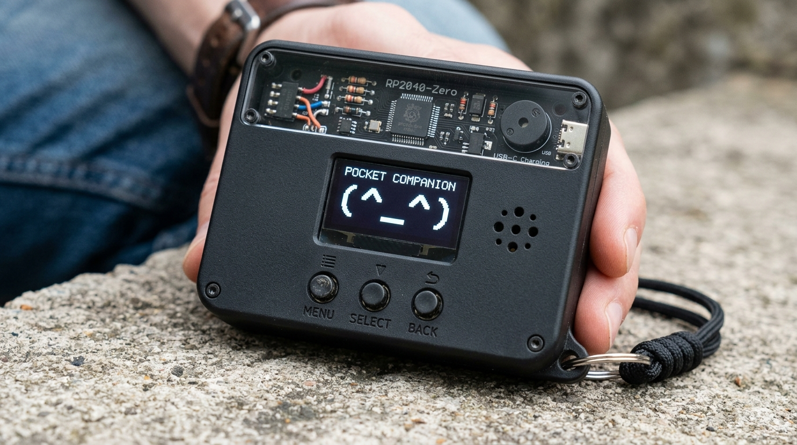
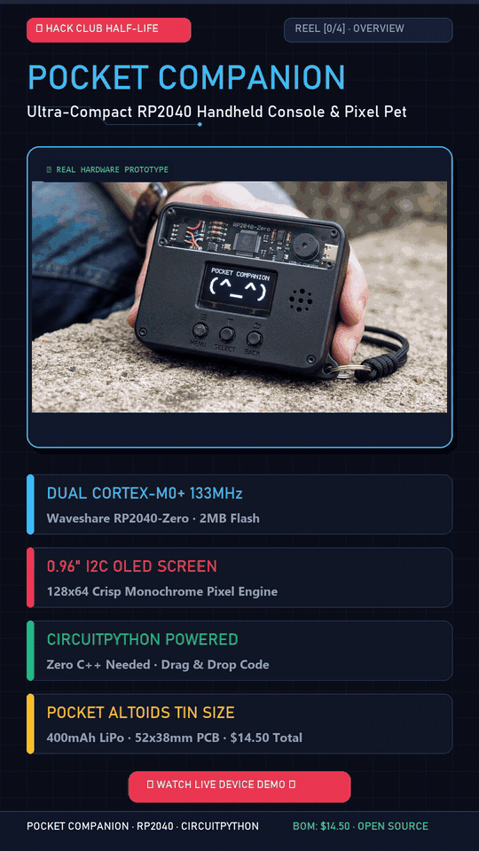

# Pocket Companion 🎮

*🎬 **Interactive Demonstration Reel** — [Watch Full 1080×1920 30fps MP4 Reel](assets/reels/pocket_companion_demo_reel.mp4) · Pixel Pet, Reflex Game, Hardware Teardown*

Pocket Companion is a tiny, Altoids-tin-sized handheld gadget I built from scratch! It packs an animated virtual pet, a quick reflex reaction mini-game, and a 25-minute Pomodoro study timer into a pocketable board powered by a Waveshare RP2040-Zero and a crisp 0.96" OLED screen.

Everything runs on **CircuitPython**—so there is zero waiting around for C++ toolchains or Arduino IDE to compile. Whenever I want to tweak an ASCII pet face or adjust the reflex game delays, I just plug in USB-C, edit `code.py`, hit save, and the board reboots and runs the new code in under two seconds!

---

## Why I Built This

I wanted something physical to keep on my desk while studying that isn't my phone. Whenever I use my phone for a Pomodoro timer, I end up getting distracted and doomscrolling for half an hour. 

With Pocket Companion:
- **Virtual Pet Mode:** An animated desk buddy that keeps you company while you study. It blinks, reacts when you feed it, and gets sleepy if neglected.
- **Reflex Tester Mode:** A fast-paced reaction game where you wait for the screen flash and test your response time down to the millisecond.
- **Study Timer Mode:** A 25-minute Pomodoro focus timer with physical button controls and a piezo buzzer alarm when the study session ends.

---

## Hardware Breakdown

I chose each part specifically to fit inside an Altoids tin or 4×6 cm perfboard footprint without burning through a tight budget:

- **Waveshare RP2040-Zero:** The standard Raspberry Pi Pico is huge (over 50 mm long) and has an awkward micro-USB port that sticks out. The RP2040-Zero shrinks the RP2040 dual-core chip down to postage-stamp size (~18×23 mm) with native USB-C, 2MB of flash, and castellated solder pads.
- **0.96" SSD1306 I2C OLED (128×64):** Only 4 wires to solder (`3V3`, `GND`, `GP0` for SDA, `GP1` for SCL). Because black OLED pixels are completely off, it draws barely any power from the battery.
- **3× 6×6 mm Tactile Buttons:** Left, Action, and Right inputs. We turn on the RP2040 internal pull-up resistors in CircuitPython (`digitalio.Pull.UP`), so each button wires directly to GND—saving us from having to cram three 10k pull-up resistors onto the perfboard!
- **Passive Piezo Buzzer:** Wired to `GP5` and driven with PWM square waves for retro 8-bit chirps, click feedback, and alarms.
- **Power & LiPo Safety:** A rechargeable 3.7V 400 mAh LiPo (type 502535) tucked right under the board. It charges over USB-C using a TP4056 board with a DW01 protection chip so the cell won't over-discharge or swell. A mini slide switch physically cuts the battery line when stowed in a backpack.

---

## Parts List & Budget (~$14.50 – $18 / ~₹1,500)

Easily stays well within the $30 Hack Club Half Life budget tier:

| Component | Qty | Est. Price (USD) | Est. Price (INR) | Source / Verified Link |
| :--- | :--- | :--- | :--- | :--- |
| Waveshare RP2040-Zero | 1 | $4.20 | ₹350 | [Amazon.in](https://www.amazon.in/dp/B09SBCKYSC) · [Waveshare](https://www.waveshare.com/rp2040-zero.htm) |
| 0.96" SSD1306 I2C OLED Display | 1 | $2.20 | ₹180 | [Amazon.in](https://www.amazon.in/dp/B0HHWGRNFG) |
| 3.7V 400 mAh LiPo Battery | 1 | $3.00 | ₹250 | [Amazon.in](https://www.amazon.in/400mAh-3-7V-LiPo-Cell-YXL-402025/dp/B0G9NL58LK) |
| TP4056 Type-C Charger Module | 1 | $0.50 | ₹40 | [Amazon.in](https://www.amazon.in/TP4056-Module-Type-Battery-Protection/dp/B0CKPKZHH3) |
| 6×6 mm Tactile Buttons (5-pack) | 1 | $0.40 | ₹30 | [Amazon.in](https://www.amazon.in/Tactile-Button-Horizontal-Momentary-6x6x5mm/dp/B0BM4MPXXJ) |
| Mini SPDT Slide Switch | 1 | $0.20 | ₹15 | [Amazon.in](https://www.amazon.in/Mini-Micro-Slide-Switch-Breadboard/dp/B0DN69L9SG) |
| Mini Passive Piezo Buzzer | 1 | $0.30 | ₹25 | [Amazon.in](https://www.amazon.in/Passive-Acoustic-Component-Speaker-electronic/dp/B07MR2KN97) |
| Double-sided Perfboard (4×6 cm) | 1 | $0.70 | ₹60 | [Amazon.in](https://www.amazon.in/Universal-Prototype-Board-Double-Side-Green-2pcs/dp/B08XNVXX8R) |
| 30 AWG Silicone Jumper Wire Spool | 1 | $1.20 | ₹100 | [Amazon.in](https://www.amazon.in/B-30-1000-Plated-Copper-Wire-Wrapping-Celsius/dp/B07L11CM8L) |
| Pocket Metal Tin Enclosure | 1 | $1.80 | ₹150 | [Amazon.in](https://www.amazon.in/HASTHIP%C2%AE-Pcs-Silver-Aluminium-Small/dp/B0FM7YLYRP/) |
| Shipping & Buffer | — | $3.50 | ₹300 | Local parts / shipping buffer |
| **Total** | | **~$18.00** | **~₹1,500** | **Under $30 cap** |

---

## Pinout & Wiring

Everything connects to the RP2040-Zero with clean point-to-point connections:

| Component | Pin on Component | Pin on RP2040-Zero | Why & Wiring Notes |
| :--- | :--- | :--- | :--- |
| **OLED Display** | VCC | `3V3` | 3.3V power rail |
| | GND | `GND` | Common ground |
| | SDA | `GP0` | I2C0 Data line |
| | SCL | `GP1` | I2C0 Clock line (running at 400 kHz) |
| **Left Button** | Pin 1 / Pin 2 | `GP2` & `GND` | Active-low with internal pull-up |
| **Action Button** | Pin 1 / Pin 2 | `GP3` & `GND` | Active-low with internal pull-up |
| **Right Button** | Pin 1 / Pin 2 | `GP4` & `GND` | Active-low with internal pull-up |
| **Piezo Buzzer** | Positive (+) | `GP5` | RP2040 PWM channel for tone generator |
| | Negative (-) | `GND` | Common ground |
| **TP4056 Charger**| OUT+ / OUT- | Slide Switch & `GND` | Regulated battery output to RP2040 5V/VIN |

---

## Real-World Build Tips & Maker Gotchas

Here are a few practical things I ran into while building and testing this:

1. **Insulate that metal tin:** If you use an Altoids or mint tin, stick a layer of kapton tape or electrical tape on the inside floor! The trimmed solder legs on the back of the perfboard will short directly against the metal tin if left exposed.
2. **LiPo placement:** The 400 mAh LiPo pouch fits flat right underneath the perfboard / display stack. Route the 30 AWG silicone wires around the edges so the battery pouch does not get pinched or punctured when closing the lid.
3. **Soldering the castellated pads:** The RP2040-Zero pads are small. Use a dab of rosin flux and a clean chisel tip so you do not accidentally bridge adjacent GPIO pins together.
4. **I2C clock speed:** In CircuitPython, the I2C bus runs smoothly at 400 kHz. If you are using longer breadboard jumper wires and get screen glitches, setting `frequency=100000` makes the bus super forgiving.

---

## Getting Started

1. **Test in the Simulator:** Check out the circuit layout and logic in the [Wokwi RP2040 Simulator](https://wokwi.com/) using [`diagram.json`](diagram.json).
2. **Flash CircuitPython:**
   - Hold the `BOOT` button on the RP2040-Zero while plugging the USB-C cable into your computer.
   - Drag and drop the CircuitPython 9.x `.uf2` file onto the `RPI-RP2` volume.
3. **Copy Libraries:**
   - Download the Adafruit CircuitPython Community Bundle.
   - Copy `adafruit_ssd1306.mpy` and `adafruit_framebuf.mpy` into the `lib/` folder on the `CIRCUITPY` drive.
4. **Copy Code:**
   - Drop [`code.py`](code.py) onto the root of the `CIRCUITPY` drive. The device will boot straight up with an opening 8-bit chirp!

---

## Custom PCB Files

If you want to skip perfboard point-to-point wiring and spin a clean custom PCB, all files and production Gerbers are ready in `/hardware`:

- **EasyEDA Schematic Source:** [`hardware/easyeda/Pocket_Companion_Schematic.json`](hardware/easyeda/Pocket_Companion_Schematic.json)
- **EasyEDA PCB Layout:** [`hardware/easyeda/Pocket_Companion_PCB.json`](hardware/easyeda/Pocket_Companion_PCB.json)
- **Manufacturing Gerbers (JLCPCB Ready):** [`hardware/gerbers/Gerber_Pocket_Companion_v1.zip`](hardware/gerbers/Gerber_Pocket_Companion_v1.zip)
