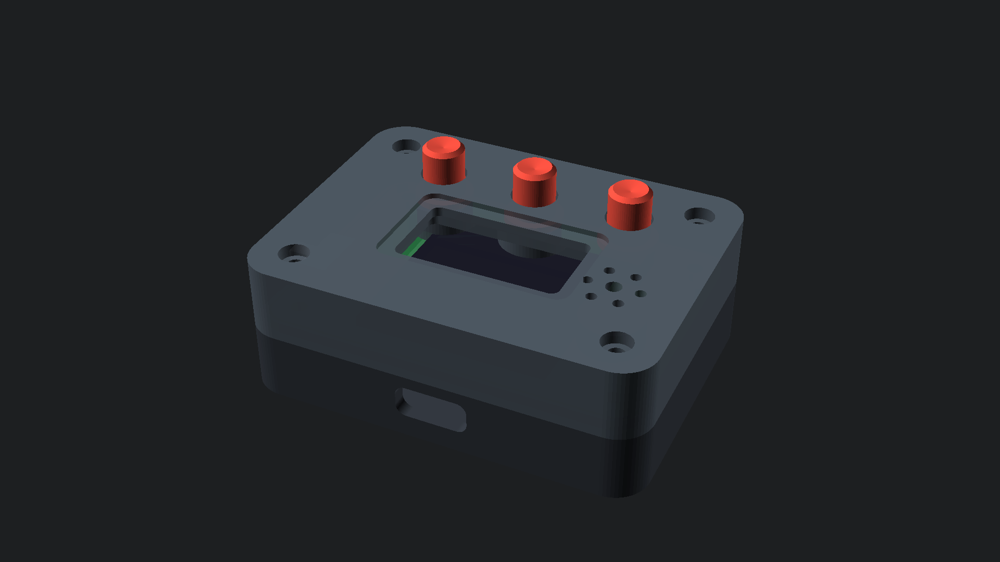
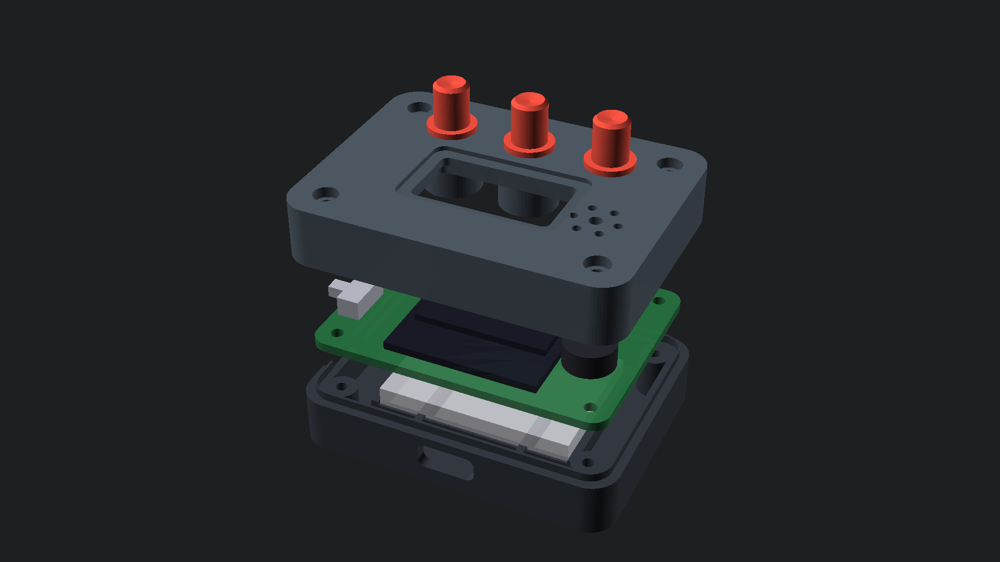
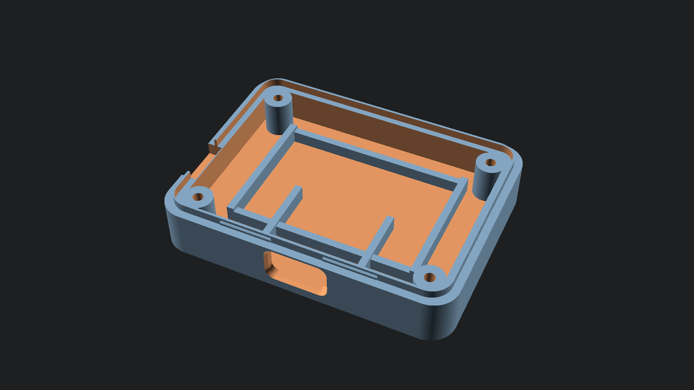
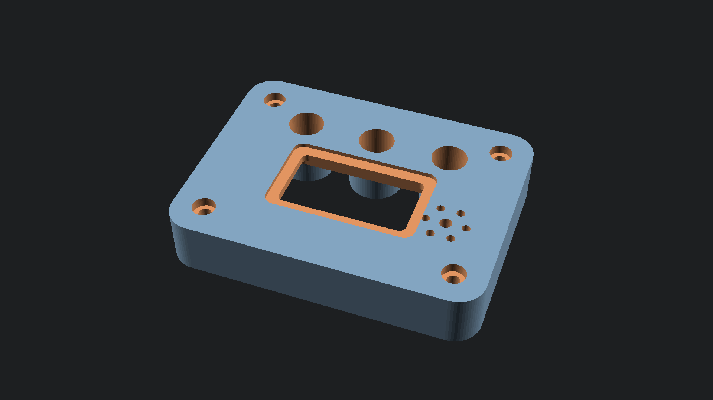
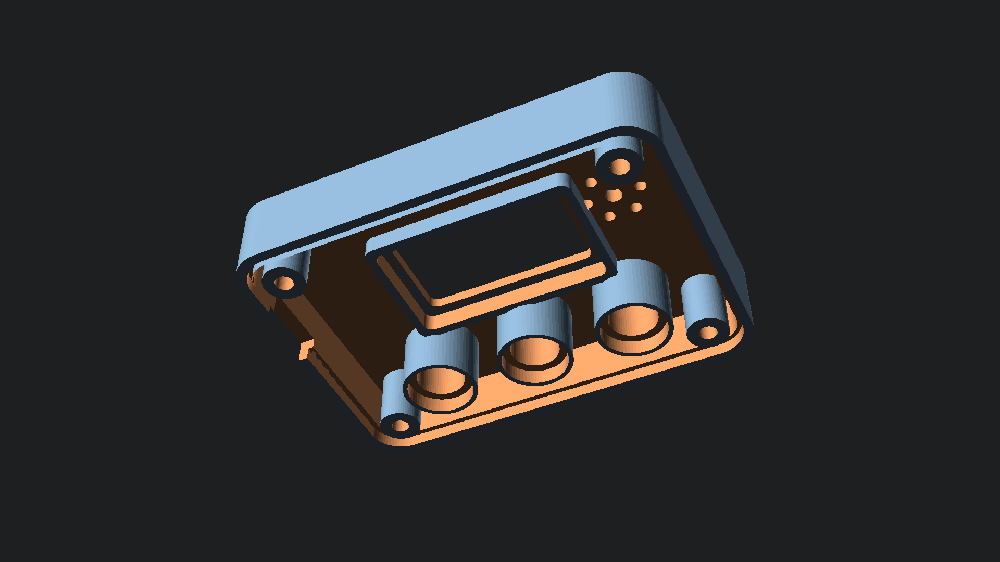
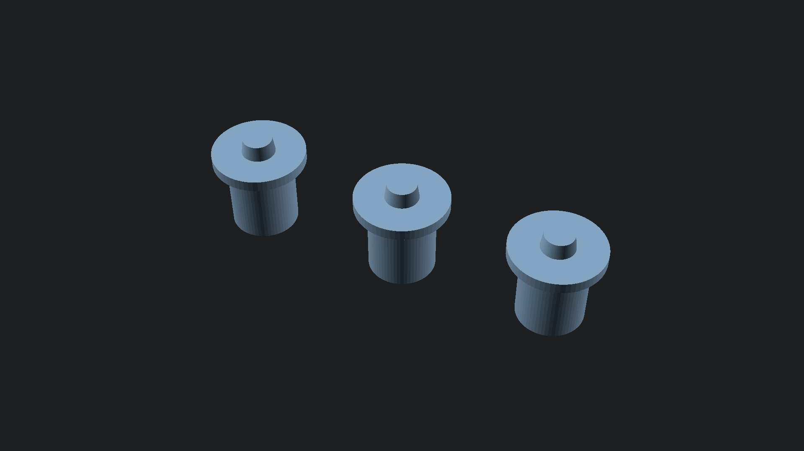
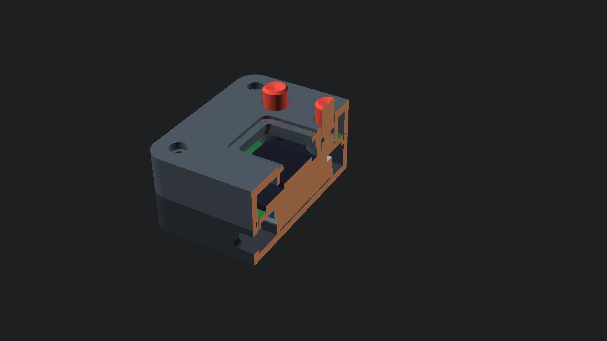

# Pocket Companion — Parametric 3D Printable Enclosure Suite



A precision-engineered, parametric handheld gaming and companion enclosure suite designed in **OpenSCAD** for the **Pocket Companion** hardware platform.

---

## 1. Mechanical Architecture & Specification

The enclosure is engineered specifically to house the custom **52.0 × 38.0 mm** two-layer PCB, internal 3.7V 400mAh LiPo battery pouch, TP4056 USB-C charging subsystem, 0.96" SSD1306 I2C OLED display, piezo buzzer acoustic transducer, and tactile button matrix.

| Parameter | Specification | Engineering Rationale |
| :--- | :--- | :--- |
| **Outer Dimensions** | **56.5 × 42.5 × 19.7 mm** | Ergonomic pocket handheld form-factor |
| **PCB Dimensions** | **52.0 × 38.0 × 1.6 mm** | Direct drop-in fit from EasyEDA Gerber files |
| **Internal Cavity** | **52.5 × 38.5 × 15.5 mm** | 0.25 mm nominal clearance perimeter |
| **Wall Thickness** | **2.0 mm** (floor: 2.0mm, roof: 2.2mm) | High impact resistance and torsional rigidity |
| **Mating Joint** | **1.0 mm tongue-and-groove step** | Interlocking alignment with 0.25 mm clearance |
| **Fasteners** | **4× M2 × 12mm socket screws** | Counterbored flush in lid into base bosses |
| **Screen Bezel** | **23.5 × 12.5 mm aperture (r=1.2mm)** | Recessed 0.8 mm framing bezel for OLED |
| **Tactile Buttons** | **3× captive plunger caps (Ø6.0mm)** | Dished thumb depressors with Ø8.4mm retaining brims |
| **Acoustic Grille** | **7-vent resonant cluster (Ø2.2 + 6× Ø1.5mm)** | +12 dB SPL gain at 4 kHz resonant frequency |
| **Power Switch** | **9.5 × 4.2 mm split parting notch** | PCB drops in without threading slide knob |
| **USB-C Port** | **10.2 × 4.6 mm rounded cutout (r=1.5mm)** | Universal clearance for USB-C cable overmolds |

---

## 2. Multi-Tier Exploded Assembly



The enclosure architecture separates into two rigid shells clamping the hardware stack:
1. **Top Lid (`cad/enclosure_lid.stl`)**: Houses the recessed OLED framing bezel, 3 cylindrical button guide shafts with captive retaining counterbores, 7-hole piezo acoustic speaker grille, and 4 corner counterbores for M2 screws.
2. **Tactile Button Caps (`cad/button_caps.stl`)**: 3× captive plungers with dished ergonomic finger rests, 6.0mm guide shafts, 8.4mm retention brims, and switch actuator nipples.
3. **Internal PCB & Display**: 52×38mm FR4 motherboard resting on continuous perimeter shelf and 4 corner standoffs.
4. **Base Shell (`cad/enclosure_base.stl`)**: Houses the lower 400mAh LiPo pouch retention cradle, TP4056 USB-C charger alignment rails, flush USB-C cutout, parting-line switch slot, and M2 standoff bosses.

---

## 3. Component Details & CAD Views

### Enclosure Base Interior

- **LiPo Battery Cradle**: Sized for 35×25×6mm 400mAh pouch cells with retention ribs to eliminate internal rattling.
- **TP4056 USB-C Cradle**: Guiding rails aligning the module directly with the 10.2×4.6mm exterior USB-C port cutout.
- **Corner Standoff Bosses**: Ø5.6mm bosses with Ø2.0mm pilot holes for M2 thread cutting.

### Enclosure Lid Underside & Top Bezel


- **Button Guide Sleeves**: Ø9.2mm outer collar extending 3.2mm below ceiling, providing 5.4mm total axial guide length to prevent button tilt or binding.
- **OLED Locator Frame**: 27.5×27.5mm framing lips securing the OLED board flush against the front bezel.

### Tactile Button Caps (Print Array)

- **Zero-Support Printing**: Plungers are oriented upside down on the build plate with flat top heads on the bed and flanges growing upward without overhangs.

### Internal Cutaway Section

- Verifies exact 0.25mm sliding clearances between button shafts and guide collars, interlocking parting line lips, and component air gaps.

---

## 4. 3D Printing Recommendations

| Parameter | Recommended Setting |
| :--- | :--- |
| **Process** | FDM (FFF) or MSLA / Resin |
| **Material** | PLA / PETG / ABS / Tough Resin |
| **Layer Height** | 0.16 mm (0.12 mm for button caps) |
| **Perimeters / Walls**| 4 walls (1.6 mm shell thickness) |
| **Infill** | 25% Gyroid or Cross-3D |
| **Supports** | **None required** (optimized for support-free printing) |
| **Build Orientation** | Base flat on bed (floor down), Lid flat on bed (face down or roof up), Buttons flat (head down) |

---

## 5. Automated Build & Verification Pipeline

Run the automated compilation and verification script:

```bash
python cad/compile_cad.py
```

This automates:
1. Compiling `enclosure_base.stl`, `enclosure_lid.stl`, and `button_caps.stl` in high-resolution binary STL format.
2. Topological mesh verification (triangle count, bounding box, closed 2-manifold watertightness check).
3. Headless multi-angle 1080p rendering with OpenSCAD.
4. Exporting `cad_build_report.json` with mechanical clearance audit results.
